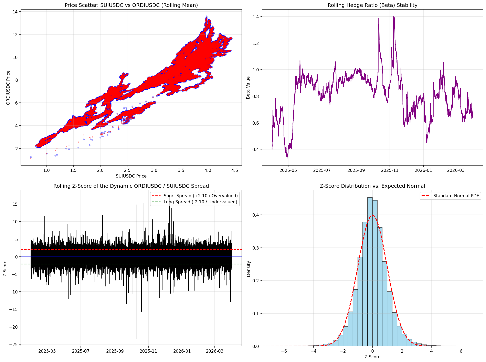
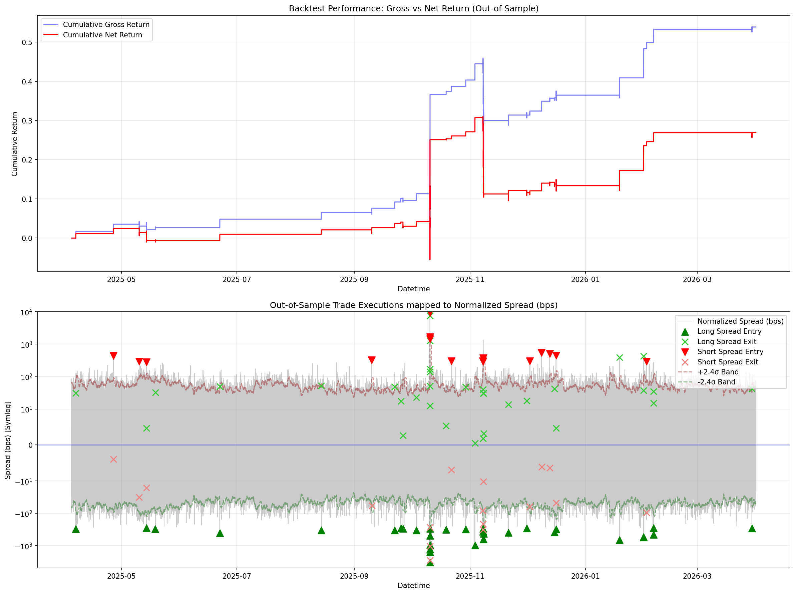

# Technical Report - Statistical Arbitrage via Cointegration and Dynamic State Estimation

**Subject:** Quantitative Finance / Algorithmic Trading  
**Assets:** ORDIUSDC / SUIUSDC (Binance)  
**Period:** April 2025 – April 2026   
**Author:** Kostas Chatzis  
**Date:** 20 Apr. 2026 

---

## 1. Executive Summary

This report evaluates the feasibility of a medium-frequency statistical arbitrage strategy between ORDIUSDC and SUIUSDC. Utilizing the `cointegration_test.py` analysis, we synchronized 525,601 one-minute data points and subjected them to statistical validation. The pair exhibits a high-confidence cointegrating relationship ($p < 0.0012$) and hyper-reverting dynamics ($H \approx 0.05$). Despite a net return of 26.90% and a Sharpe ratio of 1.12, the strategy reveals significant tail-risk, exemplified by a 21.55% maximum drawdown during a "black swan" dislocation.

## 2. Algorithmic Framework and Methodology

The system architecture follows a multi-stage quantitative pipeline:

### 2.1 Data Synchronization and Preprocessing
To eliminate micro-latency artifacts, the pipeline utilizes concurrent I/O for data acquisition and performs an inner-join on UTC timestamps. Returns are calculated as log-differences to ensure additivity:
$$R_t = \ln\left(\frac{P_t}{P_{t-1}}\right)$$

### 2.2 Predictive Lead-Lag Discovery
We employ cross-correlation analysis on smoothed log-returns to identify temporal leads. The correlation function $\rho(\tau)$ is defined as:
$$\rho(\tau) = \frac{\text{cov}(R_{target, t}, R_{feature, t-\tau})}{\sigma_{target} \sigma_{feature}}$$
Analysis indicated a **Lag 0** highest correlation (0.4936), confirming synchronous movement and the absence of a predictive "tell" at the 1-minute resolution.

### 2.3 Statistical Verification: The Engle-Granger Test
Cointegration is verified by ensuring the residuals of the regression $y_t = \beta x_t + \alpha + \epsilon_t$ are stationary ($I(0)$). We utilize the Augmented Dickey-Fuller (ADF) test on residuals to reject the null hypothesis of a random walk.

### 2.4 Stochastic Modeling of Mean Reversion
Profitability is governed by two critical metrics:
*   **Hurst Exponent ($H$):** Measures the "long-term memory" of the series. We estimate $H$ via the variance-of-lags method where $\text{Var}(z_{t+\tau} - z_t) \sim \tau^{2H}$. A value of $H < 0.5$ indicates mean reversion.
*   **Half-Life ($\lambda$):** Based on the Ornstein-Uhlenbeck process:
    $$dz_t = -\lambda(z_t - \mu)dt + \sigma dW_t$$
    The discrete-time estimation yields $HL = -\ln(2) / \lambda$. For this pair, $HL \approx 2.60$ minutes.

### 2.5 Dynamic State Estimation (Recursive Kalman Filter)
To handle non-stationary markets, we replace static OLS with a **Kalman Filter**. This algorithm treats the hedge ratio ($\beta$) and intercept ($\alpha$) as hidden states that evolve over time. The implementation uses a Constant Velocity model for the state transition:

1.  **State Prediction:** We assume the state remains constant between observations, subject to process noise $\delta$:
    $$ \theta_{t|t-1} = \theta_{t-1} $$
    $$ P_{t|t-1} = P_{t-1} + Q $$
    Where $\theta = [\alpha, \beta]^T$ and $Q = \text{diag}(\delta, \delta)$ is the process noise covariance.

2.  **Innovation (Measurement Error):** We compare the actual price $y_t$ with the predicted price:
    $$ \hat{y}_t = H_t \theta_{t|t-1} = \alpha + \beta x_t $$
    $$ e_t = y_t - \hat{y}_t $$

3.  **Kalman Gain ($K_t$):** Determines how much we trust the new observation versus the previous state:
    $$ S_t = H_t P_{t|t-1} H_t^T + R $$
    $$ K_t = P_{t|t-1} H_t^T S_t^{-1} $$
    Where $R$ is the measurement noise variance.

4.  **State Update:** The state and its covariance $P$ are adjusted based on the innovation:
    $$ \theta_t = \theta_{t|t-1} + K_t e_t $$
    $$ P_t = (I - K_t H_t) P_{t|t-1} $$

This recursive update allows for a **Dynamic Hedge Ratio** that reacts instantly to liquidity shocks without the lag inherent in moving averages.

### 2.6 Z-Score Normalization and Signal Generation
The **Z-score** transforms the raw spread into a unitless metric that expresses the current deviation in terms of standard deviations from the rolling mean. In our framework, the spread is calculated using the *prior* period's hedge ratio to avoid look-ahead bias:
$$ \text{Spread}_t = \ln(P_{target, t}) - (\beta_{t-1} \ln(P_{feature, t}) + \alpha_{t-1}) $$
The Z-score is then computed as:
$$ Z_t = \frac{\text{Spread}_t - \mu_{\text{rolling}}}{\sigma_{\text{rolling}}} $$

**Expected Distribution:** Under the assumption of market efficiency and normally distributed noise, $Z_t$ should follow a **Standard Normal Distribution** $N(0, 1)$. Statistically:
*   68.2% of data should lie within $\pm 1\sigma$.
*   95.4% should lie within $\pm 2\sigma$.
*   99.7% should lie within $\pm 3\sigma$.

Deviations from this distribution (specifically "fat tails" or kurtosis) indicate that extreme events occur more frequently than predicted by the Gaussian model. Our analysis of the SUI-ORDI spread reveals a leptokurtic distribution, necessitating higher entry thresholds (e.g., $2.4\sigma$) to avoid "steamroller" events.

### 2.7 Risk-Adjusted Performance: The Sharpe Ratio
The **Sharpe Ratio** measures the excess return per unit of volatility. Since crypto markets operate 24/7, we annualize the ratio using the total number of seconds in a year:

$$ \text{Sharpe} = \frac{E[R_p - R_f]}{\sigma_p} \times \sqrt{N_{\text{periods}}} $$

Where:
*   $R_p$ is the portfolio return per interval (1 minute).
*   $R_f$ is the risk-free rate (assumed 0 in HFT).
*   $N_{\text{periods}} = \frac{365 \times 24 \times 3600}{\text{Interval in seconds}}$

A Sharpe ratio of **1.12** indicates that the strategy provides positive risk-adjusted returns, but is susceptible to the volatility clusters observed in the Max Drawdown.

---

## 3. Empirical Results: ORDIUSDC vs SUIUSDC

### 3.1 Statistical Verdict
The pair demonstrated remarkable statistical robustness:
*   **T-Statistic:** -4.5050 (Significant at 1% level)
*   **P-Value:** 0.0012
*   **Dynamic Hurst:** 0.0519 (Hyper-reverting)
*   **Avg. Absolute Spread:** 16.81 bps

### 3.2 Trading Performance (Out-of-Sample)
The backtest incorporated 115 bps of round-trip friction (fees and slippage).

| KPI | Value |
| :--- | :--- |
| **Gross Return** | 53.85% |
| **Net Return** | 26.90% |
| **Sharpe Ratio** | 1.12 |
| **Max Drawdown** | 21.55% |
| **Total Round Trips** | 50 |

---

## 4. Risk Assessment and Strategic Critique

### 4.1 The "Steamroller" Risk
The primary failure mode identified was a catastrophic breakdown in the cointegrated relationship on October 10, 2025. The Z-score plummeted to **-32.13**, resulting in a -10.83% net loss on a single trade. This suggests that during high-volatility regimes, the standard normal assumption collapses, and the distribution becomes dominated by extreme outliers.

### 4.2 Parameter Sensitivity
The 1200-period window was necessary to stabilize the z-score signal. While the alpha is real, the execution risk is medium-high due to the 2.6-minute half-life.

---

## 5. Conclusion

The ORDI/SUI pair is a prime candidate for statistical arbitrage given its strong cointegration and rapid reversion cycles. High frictional costs and extreme tail-risk necessitate a "sniper" execution model with strict volatility-based circuit breakers. A dynamically-scaled rolling window could protect us from catching falling knifes. 

---
